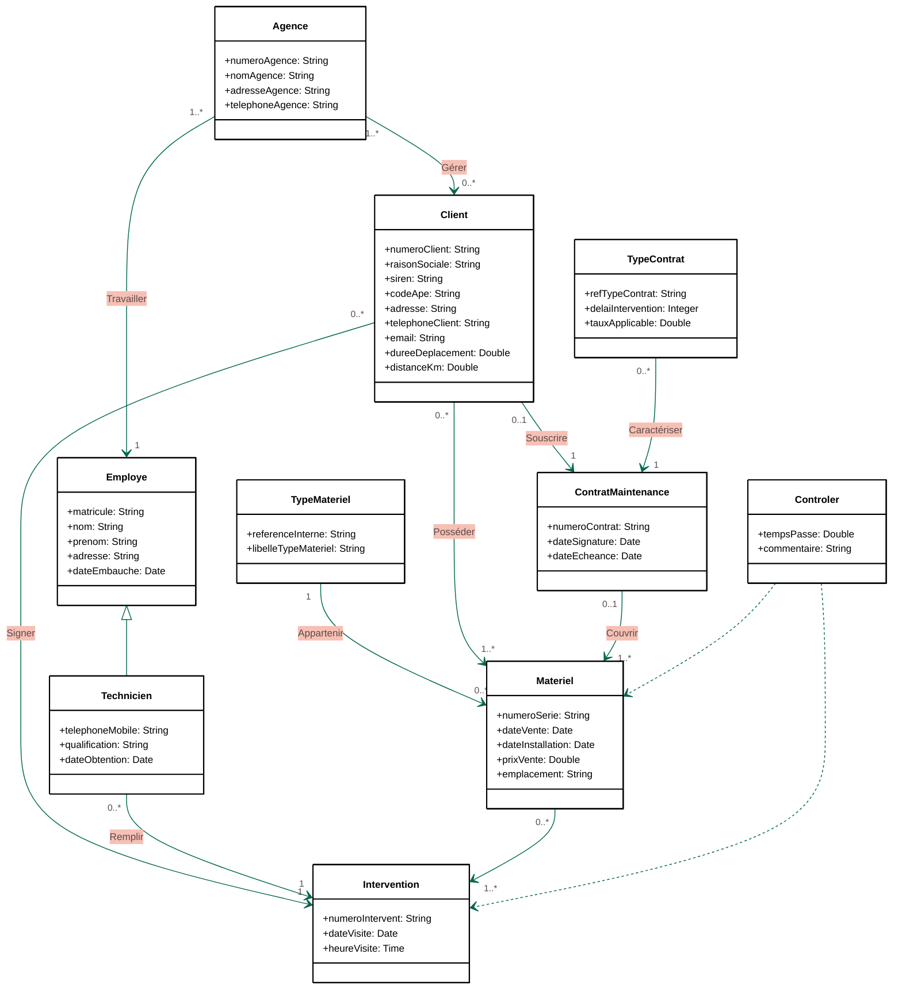

```mermaid
---
config:
  theme: base
  themeVariables:
    primaryColor: '#F7C0B5'
    primaryBorderColor: '#5B4B49'
    lineColor: '#00674F'
    primaryTextColor: '#5B4B49'
    secondaryColor: '#DA93B0'
    tertiaryColor: '#0A3C5C'
    fontSize: '12px'
---

classDiagram

  class TypeMateriel {
    +referenceInterne: String
    +libelleTypeMateriel: String
  }
  class Materiel {
    +numeroSerie: String
    +dateVente: Date
    +dateInstallation: Date
    +prixVente: Double
    +emplacement: String
  }
  class Client {
    +numeroClient: String
    +raisonSociale: String
    +siren: String
    +codeApe: String
    +adresse: String
    +telephoneClient: String
    +email: String
    +dureeDeplacement: Double
    +distanceKm: Double
  }
  class ContratMaintenance {
    +numeroContrat: String
    +dateSignature: Date
    +dateEcheance: Date
  }
  class TypeContrat {
    +refTypeContrat: String
    +delaiIntervention: Integer
    +tauxApplicable: Double
  }
  class Agence {
    +numeroAgence: String
    +nomAgence: String
    +adresseAgence: String
    +telephoneAgence: String
  }
  class Employe {
    +matricule: String
    +nom: String
    +prenom: String
    +adresse: String
    +dateEmbauche: Date
  }
  class Technicien {
    +telephoneMobile: String
    +qualification: String
    +dateObtention: Date
  }
  class Intervention {
    +numeroIntervent: String
    +dateVisite: Date
    +heureVisite: Time
  }
  
  class Controler {
    +tempsPasse: Double
    +commentaire: String
  }

  %% ==========================================
  %% RELATIONS & CARDINALITÉS
  %% ==========================================
  TypeMateriel "1" --> "0..*" Materiel : Appartenir
  Client "0..*" --> "1..*" Materiel : Posséder
  Client "0..1" --> "1" ContratMaintenance : Souscrire
  ContratMaintenance "0..1" --> "1..*" Materiel : Couvrir
  TypeContrat "0..*" --> "1" ContratMaintenance : Caractériser
  Agence "1..*" --> "0..*" Client : Gérer
  Agence "1..*" --> "1" Employe : Travailler
  Client "0..*" --> "1" Intervention : Signer
  Technicien "0..*" --> "1" Intervention : Remplir

  %% ==========================================
  %% CLASSE D'ASSOCIATION (Workaround Mermaid)
  %% ==========================================
  Materiel "0..*" --> "1..*" Intervention
  Controler ..> Materiel
  Controler ..> Intervention

  %% ==========================================
  %% HÉRITAGE
  %% ==========================================
  Employe <|-- Technicien

  %% ==========================================
  %% STYLISATION
  %% ==========================================
  classDef default fill:#ffffff,stroke:#000000,stroke-width:1.5px,color:#000000
  classDef association fill:#f8f9fa,stroke:#666666,stroke-dasharray: 5 5
```