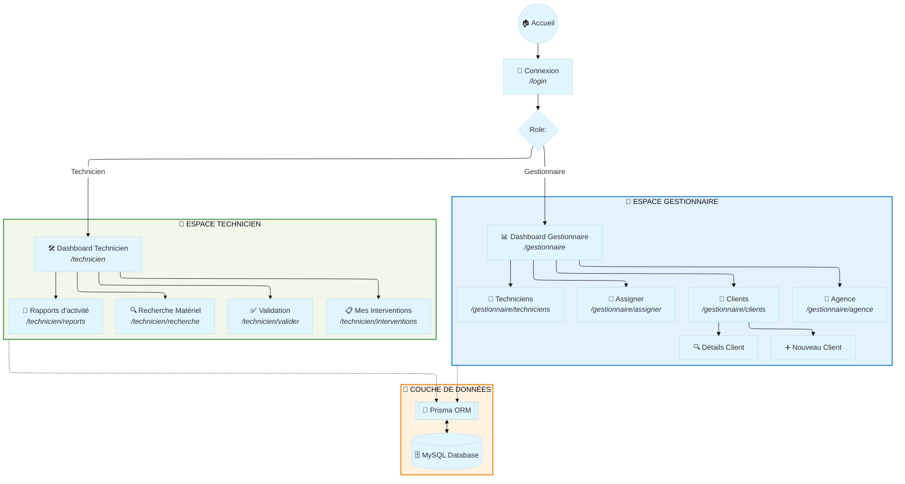
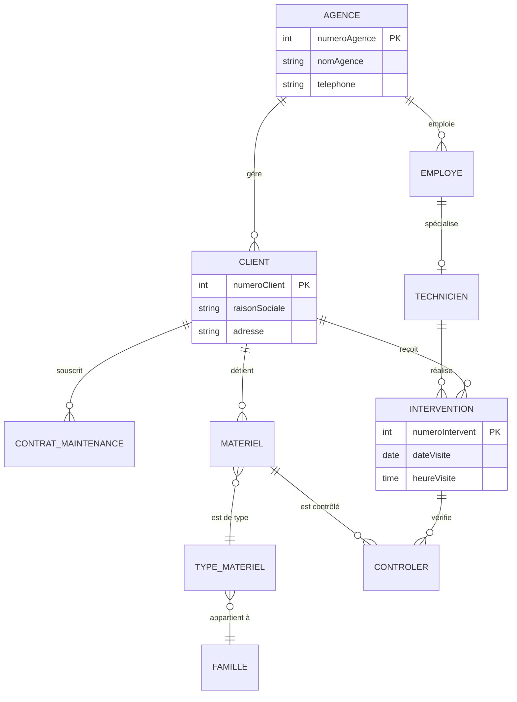

# 🗺️ Plan du Site & Architecture Technique - CashCash

Ce document constitue la référence officielle du squelette applicatif et de la structure de données pour le projet **CashCash**.

---

## 🏗️ 1. Squelette de l'Application (Arborescence)

L'application est structurée pour offrir une expérience fluide selon le profil utilisateur. Le diagramme ci-dessous illustre la navigation et l'interaction avec la base de données.

---

## 🗃️ 2. Architecture de la Base de Données (MySQL)

Le modèle de données est optimisé pour la traçabilité des interventions et la gestion du parc matériel.

---

## 🛣️ 3. Répertoire des Routes & Fonctionnalités

| Type | Route | Icône | Description | Accès |
| :--- | :--- | :---: | :--- | :--- |
| **Public** | `/` | 🏠 | Page d'atterrissage et présentation. | Libre |
| **Public** | `/login` | 🔐 | Portail d'accès sécurisé. | Libre |
| **Admin** | `/gestionnaire` | 📊 | Vue d'ensemble et statistiques de maintenance. | Gestionnaire |
| **Admin** | `/gestionnaire/clients` | 👥 | Gestion du portefeuille clients et contrats. | Gestionnaire |
| **Field** | `/technicien` | 🛠️ | Planning quotidien des interventions. | Technicien |
| **Field** | `/technicien/interventions` | 📅 | Détails techniques et historique client. | Technicien |
| **Système**| `/api/*` | ⚙️ | Couche de service pour les échanges MySQL. | Système |

---

## 🛠️ 4. Stack Technique & Skeleton
> [!NOTE]
> L'architecture repose sur un modèle **Client-Serveur** moderne utilisant Next.js.

- **Frontend** : React.js, Next.js avec **Tailwind CSS** pour une interface responsive et moderne.
- **Backend** : API Routes (Next.js) agissant comme middleware entre l'UI et la DB.
- **Persistance** : **MySQL 8.0** hébergé, avec **Prisma** pour la sécurité des types et la performance des requêtes.
- **Navigation** : Système de Layouts imbriqués permettant une persistence des menus (Sidebar) sans rechargement.

---

## 🎨 Légende du Diagramme
| Symbole | Signification |
| :---: | :--- |
| `🏠` | Point d'entrée public |
| `👑` | Accès restreint aux Gestionnaires |
| `🔧` | Accès restreint aux Techniciens |
| `💾` | Persistance des données (MySQL) |
| `-.->` | Flux de données asynchrone (API) |
